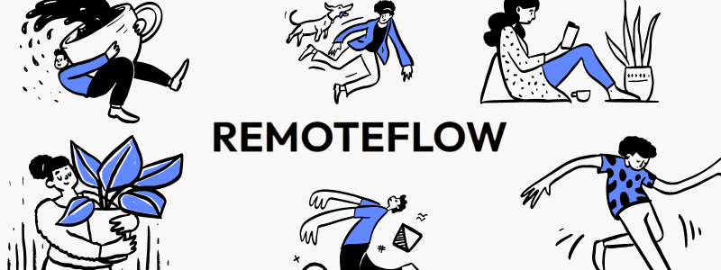
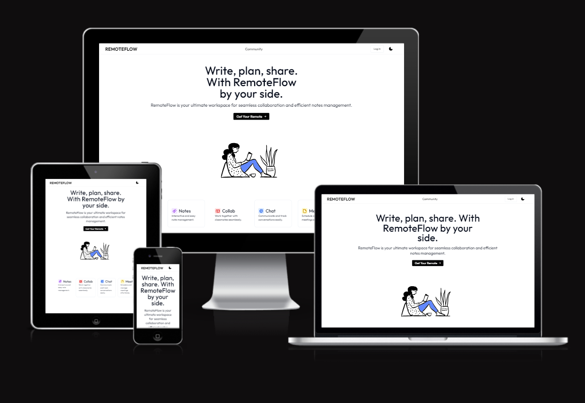

  

  
  
  
   <a href="https://github.com/Dipeshdahiya/Remoteflow/graphs/contributors">
  

  

RemoteFlow is a user-friendly, collaborative notes-making platform designed to streamline team collaboration. It features a secure login and signup system, a dynamic dashboard for easy navigation, and seamless real-time editing. With its intuitive interface, users can effortlessly manage notes, collaborate with team members, and track document changes. The dashboard ensures easy access to ongoing projects, while the responsive design guarantees a smooth experience across all devices. Whether for personal organization or team productivity, RemoteFlow simplifies the way users interact and work together online.

  

## ⚛ Project Structure ⚛
bash
RemoteFlow/
├── app/                      # Application logic
├── components/               # Reusable components
├── lib/                      # Library or utility functions
├── prisma/                   # Prisma setup for database
├── public/                   # Public assets like images, etc.
├── readme_images/            # Images for the README
├── .dockerignore             # Docker ignore rules
├── .env.example              # Example environment variables
├── .eslintrc.json            # ESLint configuration
├── .gitignore                # Git ignore rules
├── components.json           # Component registry/configuration
├── Dockerfile                # Docker file to create Docker Image
├── global.d.ts               # Global TypeScript declarations
├── middleware.ts             # Middleware logic
├── next.config.js            # Next.js configuration
├── package.json              # npm configuration and dependencies
├── package-lock.json         # Lockfile for npm dependencies
├── postcss.config.js         # PostCSS configuration
├── README.md                 # Project documentation
├── tailwind.config.js        # Tailwind CSS configuration (JS)
├── tailwind.config.ts        # Tailwind CSS configuration (TS)
├── tsconfig.json             # TypeScript configuration

  

## 👉 Getting Started 👍

First, run the development server:

bash
npm run dev
# or
yarn dev
# or
pnpm dev
# or
bun dev

Open [http://localhost:3000](http://localhost:3000) with your browser to see the result.

You can start editing the page by modifying app/page.tsx. The page auto-updates as you edit the file.

This project uses [next/font](https://nextjs.org/docs/basic-features/font-optimization) to automatically optimize and load Inter, a custom Google Font.

  

## 🐳 Running with Docker 🐳

To run the application using Docker, follow these steps:

1. Build the Docker Image
First, build the Docker image by running:

bash
docker build -t remoteflow .

2. Run the Docker Container
Once the image is built, you can run the application using the following command:

bash
docker run -e DATABASE_URL=<YOUR_DATABASE_URL> `
-e JWT_SECRET="mysecretkey" `
-e GOOGLE_CLIENT_ID=<YOUR_GOOGLE_CLIENT_ID> `
-e GOOGLE_CLIENT_SECRET=<YOUR_GOOGLE_CLIENT_SECRET> `
-e GITHUB_ID=<YOUR_GITHUB_ID> `
-e GITHUB_SECRET=<YOUR_GITHUB_SECRET> `
-e NEXTAUTH_URL="http://localhost:3000" `
-e NEXTAUTH_SECRET="token_generated" `
-p 3000:3000 remoteflow

This will start the application, and you can access it on http://localhost:3000.

Make sure to replace the environment variables with your own credentials if necessary.

## Learn More

To learn more about Next.js, take a look at the following resources:

- [Next.js Documentation](https://nextjs.org/docs) - learn about Next.js features and API.
- [Learn Next.js](https://nextjs.org/learn) - an interactive Next.js tutorial.

You can check out [the Next.js GitHub repository](https://github.com/vercel/next.js/) - your feedback and contributions are welcome!

## Deploy on Vercel

The easiest way to deploy your Next.js app is to use the [Vercel Platform](https://vercel.com/new?utm_medium=default-template&filter=next.js&utm_source=create-next-app&utm_campaign=create-next-app-readme) from the creators of Next.js.

Check out our [Next.js deployment documentation](https://nextjs.org/docs/deployment) for more details.

   

## ❓ How To Contribute ❓

  ### 1️⃣ Getting Started

  - *Fork*: Grab your personal copy by forking the repository.
  - *Clone*: Bring it on your local machine with git clone YOUR-REPO-LINK.
  bash
    git clone YOUR-REPO-LINK

  - *Setup*: Install necessary tools. Just run command.

  ### 2️⃣ Making Meaningful Changes

  - *Understand*: Dive deep and understand the project structure.
  - *Code*: Always follow our coding standards. We believe in clean and readable code!

  ### 3️⃣ Share Your Brilliance: Create a Pull Request

  - *Test*: Before anything, make sure everything works as expected.
  - *Branch*: Keep your work organized by creating a new branch with:
   bash
    git checkout -b feature/your-feature-name

  - *Commit*: Make sure your commit messages are clear and descriptive. For example:
  bash
    git commit -m 'Add some feature'

  - *Push*: Push your changes to your repository using:
  bash
   git push origin feature/your-feature-name

  - *PR*: Last but not least, open a pull request. We promise to review it as soon as possible!## 💡 How to Contribute

  

## 📲 Check Responsive 📲

RemoteFlow is designed with a mobile-first approach, ensuring usability across all devices. Click the image below to check its responsive design.

  

  

  <h2>🙌 Our Amazing Contributors 🙌</h2>
  

  

  
  <h3 align="left">Maintained By - Dipesh Dahiya  (https://github.com/Dipeshdahiya)</h3>

